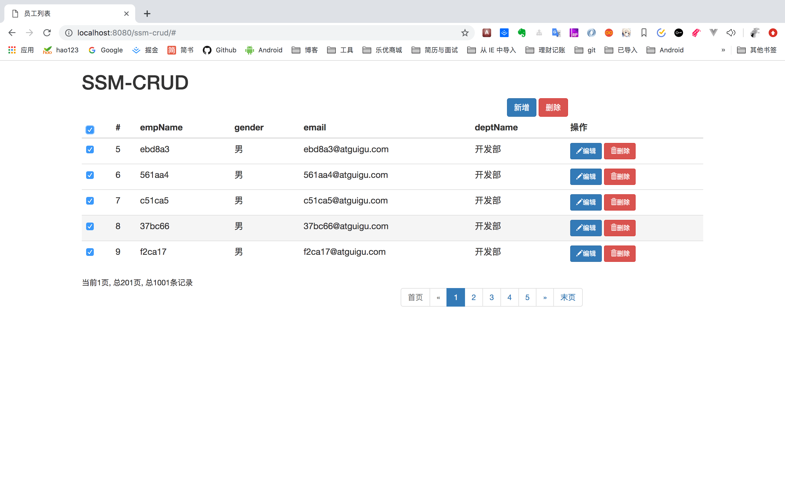

# ssm-crud

### 项目说明

尚硅谷SSM整合配套代码,  全程使用idea编写

对应b站视频[av35988777](https://www.bilibili.com/video/av35988777)

其中mybatis-generator工程使用了mybatis逆向工程用于生成mapper、接口类等文件, 请参照[IDEA—Mybatis逆向工程](https://www.jianshu.com/p/c89a888a53e3)这篇博客生成文件, 然后将生成的文件拷贝至ssm-crud工程

运行项目请使用ssm-crud

数据库导入请执行目录中的ssm_crud.sql, 并修改两个工程中的jdbcConfig.properties中的数据库连接配置, 确保连接正确

### 运行截图

